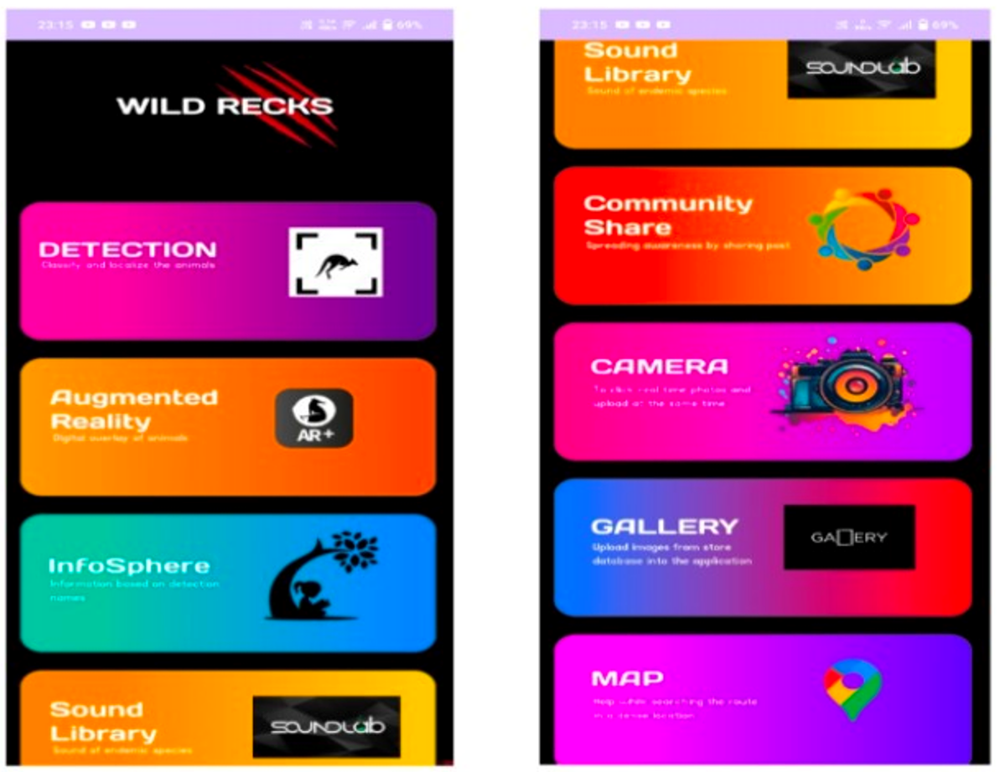
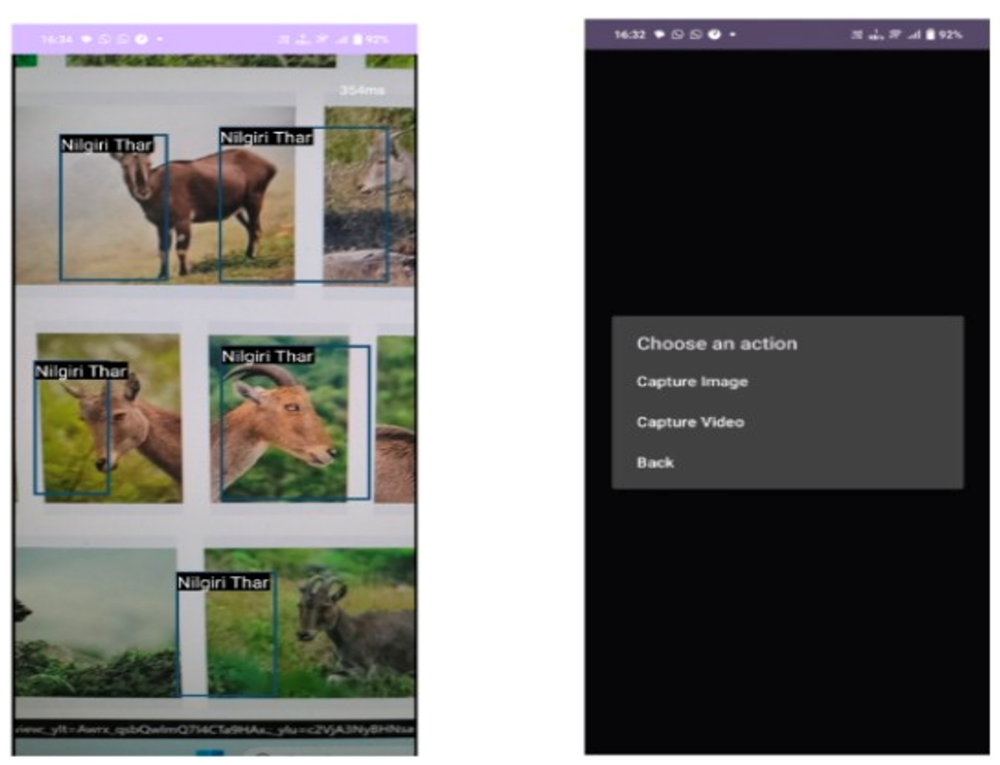
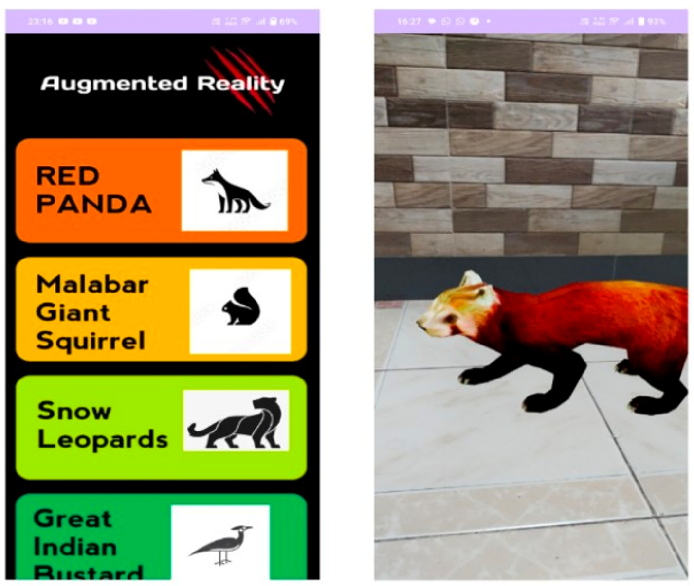
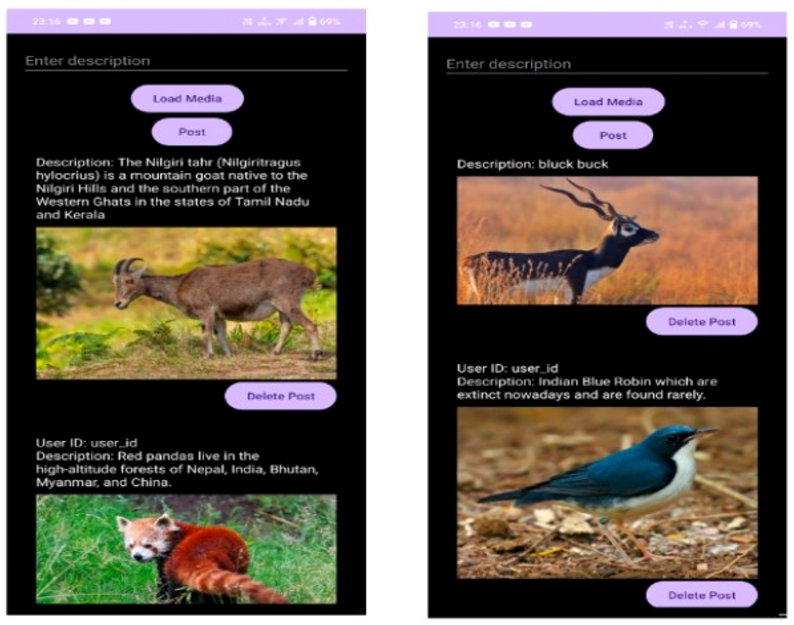

# Wild Recks: AI-Powered Wildlife Identification App

Wild Recks is a native Android application built using a hybrid **Java and Kotlin** architecture. Designed specifically for conservationists, wildlife enthusiasts, and tourists in India, the application leverages a custom-trained **YOLOv8 Object Detection model (converted to TensorFlow Lite)** to identify distinct, endangered, and rare animal species indigenous to various regions of India in real time.

Beyond core machine learning detection, Wild Recks integrates an immersive Augmented Reality (AR) module, an educational encyclopedia, acoustic libraries, geospatial mapping, and an interactive community hub to create a comprehensive ecosystem for wildlife exploration.

---

## 📸 Application Preview

The following screenshots demonstrate the core user interface and features of the application. These assets are located within the project's `/assets` directory.

| Component | Visual Preview                                                                     | Description |
| :--- |:-----------------------------------------------------------------------------------| :--- |
| **User Interface Overview** |        | **Application Home Look:** The main entry point showcasing the clean, modern dashboard, quick access navigation grid, and recent community highlights. |
| **Real-Time Detection** |         | **Live YOLOv8 Detector:** The active camera view utilizing the edge-optimized TFLite model to track and identify a *Nilgiri Tahr* with high bounding-box confidence. |
| **Immersive Experience** |  | **Augmented Reality Look:** Interactive 3D rendering of rare Indian species projected into the real-world environment via ARCore capabilities. |
| **Social Ecosystem** |          | **Community Share Look:** The social feed where users publish validated sightings, exchange geolocation insights, and interact with fellow wildlife observers. |

---

## 🚀 Core Features

### 1. Distinct Animal Species Detection
The application features an on-device, real-time object detection engine optimized for mobile processing limits. The machine learning pipeline is currently configured to recognize **10 highly distinct and endangered Indian species**:
* **Mammals:** Black Buck, Lion-Tailed Macaque, Malabar Giant Squirrel, Nilgiri Tahr, Pygmy Hog, Red Panda, Snow Leopard.
* **Birds:** Great Indian Bustard, Indian Robin, Himalayan Monal.

### 2. Immersive Augmented Reality (AR)
For supported hardware, Wild Recks deploys an AR environment allowing users to interact with life-sized, high-fidelity 3D models of these rare species. This functions as an invaluable educational tool for experiencing elusive animals (like the Snow Leopard or Pygmy Hog) safely and up close.
> ⚠️ **Hardware Requirement:** This feature automatically detects compatibility and is restricted to devices that natively support **Google Play Services for AR (ARCore)**.

### 3. Comprehensive Species Wikipedia
An in-app encyclopedia loaded with deep environmental, behavioral, and conservation status data (IUCN ratings) for every supported species. Users can seamlessly transition from a live camera detection directly to its encyclopedic breakdown to learn about its natural habitat and dietary patterns.

### 4. Acoustic Wildlife Sound Library
Visual detection is paired with acoustic education. The app hosts a high-quality sound library enabling users to listen to vocalizations, mating calls, and warning signals of these specific Indian animals, assisting in auditory identification out in the field.

### 5. Interactive Community Share
A built-in localized social platform allowing users to post rare media, log findings, and share high-resolution images or videos of their wilderness discoveries. The community feed serves to crowd-source wildlife distribution data across country zones.

### 6. Integrated In-App Camera
A custom camera interface engineered with optimized capture settings to ensure high-shutter speed photography, minimizing motion blur when capturing fast-moving animals in dense brush.

### 7. Native In-App Gallery
An isolated media management system within the application that stores, organizes, and labels captured photos and videos based on the detected species metadata.

### 8. Geospatial In-App Maps
Leveraging mapping SDKs, this feature allows users to drop a pin on a geographical map at the exact location where an animal was spotted. This historical tracking system helps map migration paths and high-density zones over time.

---

## 🛠️ Tech Stack & Architecture

* **Platform:** Android (Min SDK 24 / Target SDK 34)
* **Languages:** Kotlin & Java (Hybrid Architecture)
* **IDE:** Android Studio
* **Build System:** Gradle (Compatible with Gradle 8.5+ & Java 21)
* **Machine Learning Engine:** TensorFlow Lite (TF Lite) interpreter
* **Model Framework:** Ultralytics YOLOv8
* **AR Framework:** Google ARCore SDK

---

## ⚙️ Custom Model Setup & Configuration

To scale this repository or drop in a newly trained custom YOLOv8 model, follow these integration steps:

### 1. File Placement
Export your custom model from PyTorch/YOLOv8 to a TensorFlow Lite format (`.tflite`) with metadata. Place both your model file and your class labels file inside the asset directory:
```text
app/src/main/assets/
├── your_custom_model.tflite
└── your_custom_labels.txt